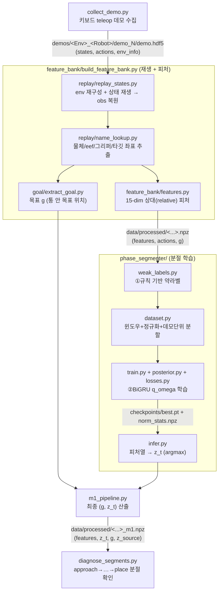
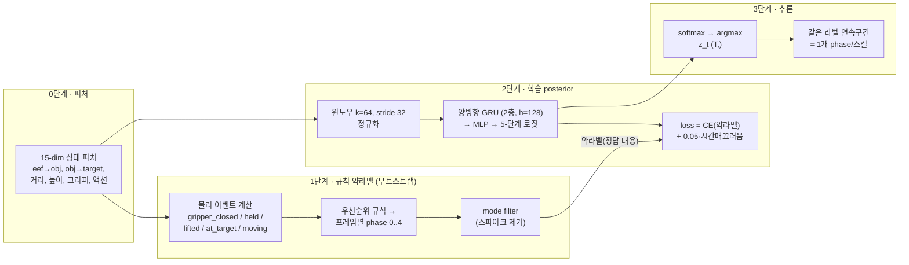

# 코드 구조 & Phase(스킬) 분절 알고리즘 설명

이 문서는 `ICRA/` 안의 코드가 **데모를 어떻게 수집하고, 어떻게 phase(스킬) 단위로
분절(segment)하는지**를 정리합니다. (논문 프레임워크의 **Module 1: 목표 추론 + phase
분절**에 해당하며, `(g, z_t)`를 다음 모듈이 받아씁니다.)

> **핵심 한 줄**: 이 코드는 명시적 "경계 검출(changepoint)" 알고리즘이 **아닙니다**.
> 매 시점(timestep)마다 5개 단계 중 하나로 **프레임별 분류**를 하고,
> **같은 라벨이 연속된 구간 하나 = 하나의 phase(스킬)** 가 됩니다.
> 즉 분절은 라벨이 바뀌는 지점에서 자동으로 생깁니다.

---

## 1. 전체 데이터 흐름



---

## 2. 파일 구조 (역할별)

| 파일 / 폴더 | 역할 |
|-------------|------|
| `collect_demo.py` | 키보드 teleop 데모 수집기 (환경/로봇 선택, 카메라 이동, 팔 롤링, y/n 저장, 개수 지정) |
| `replay/replay_states.py` | 저장된 `env_info`로 env 재구성 후 상태를 재생해 관측(obs) 복원 (headless) |
| `replay/name_lookup.py` | obs/sim에서 물체 위치·eef 위치·그리퍼·타깃 placement·테이블 높이 추출 (PickPlace 객체 범용) |
| `replay/hdf5_utils.py` | `demo.hdf5` 읽기, `demos/**/demo.hdf5` 재귀 탐색, `env_info` 파싱 |
| `feature_bank/features.py` | 15-dim **상대** 피처 계산 (4-dim/7-dim 액션 모두 지원) |
| `feature_bank/build_feature_bank.py` | 모든 데모를 재생 → 피처 + 목표 `g`를 `data/processed/*.npz`로 저장 |
| `goal/extract_goal.py` | 목표 `g` 추출 (`target_bin_placements` → 물체 최종위치 폴백) |
| `phase_segmenter/weak_labels.py` | **①규칙 기반 약라벨** (물리 이벤트 → 프레임별 phase) |
| `phase_segmenter/posterior.py` | **②학습 모델** `q_omega(z_t \| 피처)` = BiGRU + MLP head |
| `phase_segmenter/dataset.py` | 윈도우 자르기(k, stride) + 정규화 + **데모 단위** train/val 분할 |
| `phase_segmenter/losses.py` | `CE`(vs 약라벨) + 시간 매끄러움 손실 (+ 선택 aux MSE) |
| `phase_segmenter/train.py` | 학습 루프 → `checkpoints/best.pt`, `norm_stats.npz` |
| `phase_segmenter/infer.py` | 학습모델 로드 → 피처열 → `z_t = argmax` |
| `phase_segmenter/visualize.py` | 데모별 phase 타임라인 PNG + CSV |
| `m1_pipeline.py` | 전체 오케스트레이션 → 데모별 `(g, z_t)` = `*_m1.npz` |
| `diagnose_segments.py` | `z_t`가 approach→…→place로 분절됐는지 **텍스트로** 진단 |
| `inspect_demo.py` | `demo.hdf5` 구조/액션 차원 확인 |
| `m1_config.py` | config 로드 / 경로 해석 / phase 이름 |
| `configs/m1_goal_phase_pickplace_can.yaml` | 모든 하이퍼파라미터의 단일 소스 |

---

## 3. 분절 알고리즘 (2단계 구조)



### 0단계 — 상대(relative) 피처 15-dim (`features.py`)
데모마다 물체 위치가 달라서 **절대 좌표 대신 상대 벡터**를 씁니다(위치 불변 → 일반화).
- `eef→obj`(3), `obj→target`(3), 두 거리(2), 물체 높이(1), 그리퍼 열림(1),
  액션 위치델타 3 + 그리퍼 1, 액션 크기(1) = **15차원**
- 4-dim(OSC_POSITION) / 7-dim(OSC_POSE) 액션 모두 위치델타 3 + 그리퍼(action[-1])만 써서 항상 15-dim.

### 1단계 — 규칙 기반 약라벨 (`weak_labels.py`)
시뮬레이터 없이 **피처만으로** 프레임마다 물리 이벤트를 계산합니다(임계값은 config):

| 이벤트 | 정의 |
|--------|------|
| `gripper_closed` | 명령 그리퍼 값 > 0 |
| `held` | (eef–obj 거리 < 0.06) **AND** 그리퍼 닫힘 |
| `lifted` | 물체 높이 > 0.04 |
| `at_target_xy` | 물체–목표 XY거리 < 0.05 |
| `moving_toward` | 목표까지 XY거리가 감소 중 |

그리고 **우선순위 규칙**으로 프레임별 단계 결정:
```
if 목표 근처 & (그리퍼 열림 or 낮게 안착):     → place(4)
elif 잡음 & 들림:  목표로 이동중이면 transport(3), 아니면 lift(2)
elif 잡음:                                     → grasp(1)
else:                                          → approach(0)   ← 삽질/헤맴 흡수
```
마지막에 `mode filter`(폭 3)로 한 프레임짜리 튐 제거.

> **설계 핵심**: 물체를 **안 잡은 모든 구간(빙빙 돌기 등)은 무조건 approach로 흡수** →
> 쓸데없는 단계를 만들지 않음(구조적 노이즈 제거의 출발점).

### 2단계 — 학습 posterior (`posterior.py` + `train.py`)
규칙이 있는데 왜 또 학습? → **약라벨은 노이즈가 많고 경계가 지저분**합니다.
**BiGRU가 앞뒤 시간 문맥을 보고** 이를 매끈하게 정리·일반화합니다.
- **모델**: 15-dim 피처열 → **양방향 GRU**(2층, hidden 128) → MLP → 프레임별 5-단계 로짓
- **데이터**(`dataset.py`): 길이 64 윈도우(stride 32), train에서만 계산한 mean/std로 정규화,
  **데모 단위** train/val 분할(시점 누수 방지)
- **손실**(`losses.py`): `CE(모델, 약라벨)` + `0.05 × 시간매끄러움`(인접 프레임 급변 억제)
- **best 선택**: val **macro-F1**(sklearn 없으면 accuracy) 최고 에폭 → `best.pt`

### 3단계 — 추론 & 분절 완성 (`infer.py` → `m1_pipeline.py`)
- `segment(features)`: 정규화 → GRU forward → **softmax → argmax** → 시점별 단계 `z_t (T,)`
- `m1_pipeline.py`가 `z_t`를 `*_m1.npz`에 저장(`z_source=q_omega`)
- **여기서 분절 완성**: `z_t`에서 같은 값이 연속된 구간 하나 = 하나의 phase/스킬.
  예) `00000 111 2222 33333 444` → approach·grasp·lift·transport·place 5개 스킬.

### 목표 g (`extract_goal.py`)
분절과 별개로, 목표 위치 `g`는 학습이 아니라 env에서 추출:
`target_bin_placements[object_id]`(통 안 목표), 없으면 물체 최종 위치로 폴백.

---

## 4. 한눈에 요약

| 질문 | 답 |
|------|-----|
| 어떻게 분절? | **프레임별 5-단계 분류** → 같은 라벨 연속 구간 = 1개 스킬 |
| 경계는? | 별도 경계검출 없음. **라벨 바뀌는 지점 = 경계** |
| 라벨 출처? | ① 규칙(약라벨) 부트스트랩 → ② BiGRU가 학습해 매끈하게 |
| 왜 5단계? | 삽질/헤맴을 approach로 흡수(구조적 노이즈 제거)가 핵심 |
| 최종 출력 | 데모별 `(g, z_t)` — g=목표, z_t=시점별 스킬 라벨 |

## 5. 실행 순서

```bash
conda activate robosuite
cd ICRA
# 1) 수집
python collect_demo.py --environment PickPlaceCan --robots Panda --num-demos 20
# 2) 피처+목표
python feature_bank/build_feature_bank.py --config configs/m1_goal_phase_pickplace_can.yaml
# 3) 분절 학습
python phase_segmenter/train.py           --config configs/m1_goal_phase_pickplace_can.yaml
# 4) 최종 (g, z_t)
python m1_pipeline.py                      --config configs/m1_goal_phase_pickplace_can.yaml   # z_source=q_omega 확인
# 5) 분절 잘 됐는지 확인
python diagnose_segments.py                --config configs/m1_goal_phase_pickplace_can.yaml
```

> 이 파일들은 **Module 1**(목표 추론 + phase 분절)입니다. README의 D-REX/SSRR 스킬 정책
> 학습·가지치기(pruning)인 **Phase 2**는 아직 이 코드엔 없고, `(g, z_t)`를 다음 모듈이 받아씁니다.
